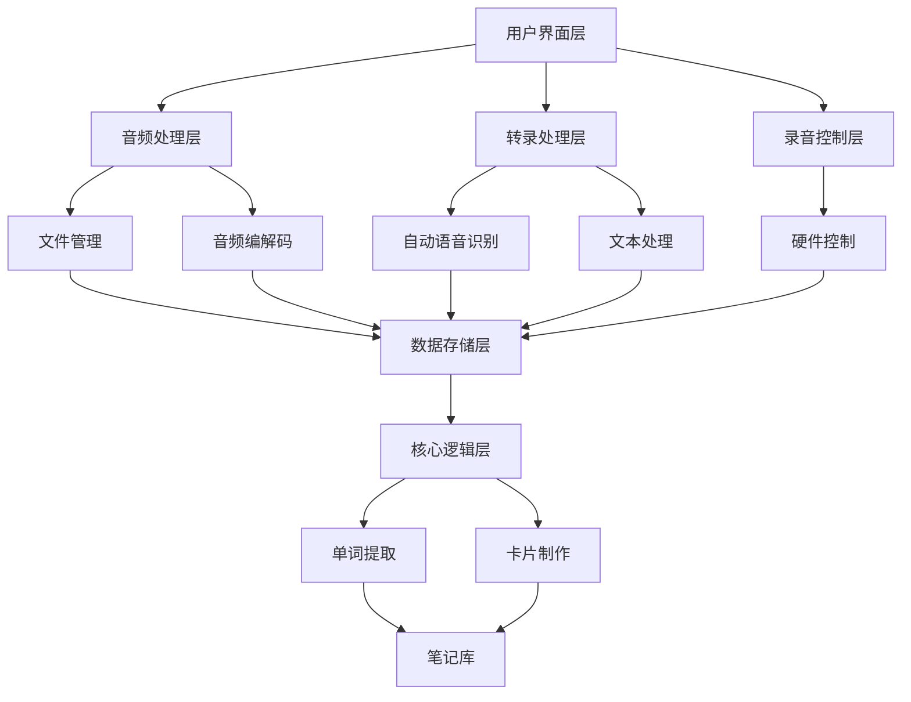
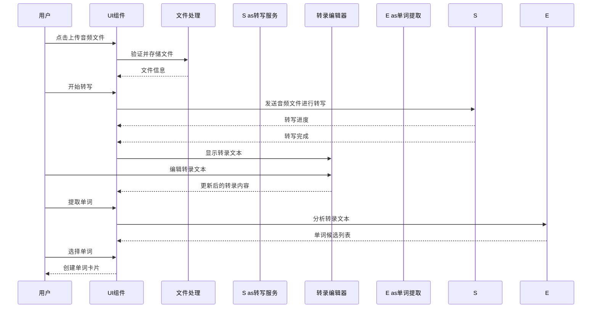
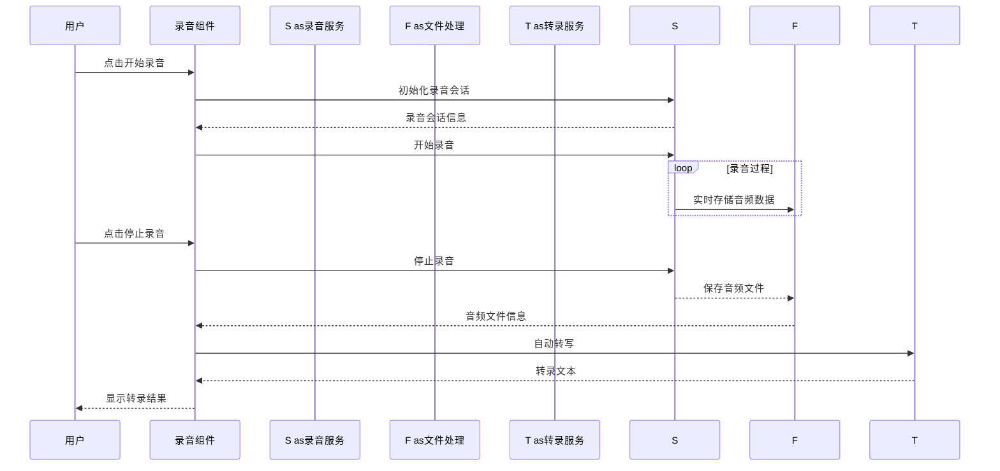

# 录音功能设计文档

## 1. 系统架构设计

### 1.1 整体架构



### 1.2 组件架构

```typescript
// 音频管理组件
class AudioManager {
  // 音频文件处理
  async processAudioFile(file: File): Promise<AudioMetadata>;

  // 录音管理
  async startRecording(): Promise<RecordingSession>;
  async stopRecording(): Promise<AudioFile>;

  // 音频播放
  async playAudio(audioId: string): Promise<void>;
  async pauseAudio(audioId: string): Promise<void>;
  async seekAudio(audioId: string, position: number): Promise<void>;
}

// 转录服务
class TranscriptionService {
  // 音频转写
  async transcribeAudio(audioId: string): Promise<Transcript>;

  // 实时转写
  async startLiveTranscription(audioId: string): Promise<TranscriptStream>;

  // 转录编辑
  async editTranscript(transcriptId: string, changes: TranscriptChanges): Promise<Transcript>;
}

// 单词提取服务
class WordExtractor {
  // 从转录文本提取单词
  async extractWords(transcript: Transcript): Promise<WordCandidate[]>;

  // 分析单词语境
  async analyzeWordContext(word: string, transcript: Transcript): Promise<ContextAnalysis>;
}
```

## 2. 数据模型设计

### 2.1 音频记录模型

```typescript
interface AudioRecording {
  id: string;                // 音频记录唯一标识
  filename: string;          // 原始文件名
  duration: number;          // 音频时长（秒）
  fileSize: number;          // 文件大小（字节）
  fileType: string;          // 文件类型（MP3、WAV、M4A 等）
  audioPath: string;         // 文件系统路径
  transcript?: Transcript;   // 转写内容（可选）
  recordedAt: Date;          // 录制或上传时间
  processed: boolean;        // 是否已处理
  language: string;          // 音频语言
}

interface Transcript {
  id: string;                // 转录唯一标识
  segments: Array<{
    id: string;              // 段落唯一标识
    text: string;            // 段落文本
    startTime: number;       // 开始时间（秒）
    endTime: number;         // 结束时间（秒）
    confidence: number;      // 置信度（0-1）
  }>;
  language: string;          // 语言
  edited: boolean;          // 是否已编辑
}

interface WordCandidate {
  word: string;              // 单词文本
  occurrences: number;       // 出现次数
  contexts: string[];        // 单词所在的上下文
  difficulty?: number;       // 估计难度
}

interface ContextAnalysis {
  word: string;              // 单词
  contexts: ContextInfo[];   // 上下文信息
  collocations: string[];    // 常见搭配
  frequency: number;         // 出现频率
}

interface ContextInfo {
  text: string;              // 上下文文本
  startTime: number;         // 开始时间（秒）
  endTime: number;           // 结束时间（秒）
  audioSegmentId: string;    // 音频段落 ID
}
```

## 3. UI组件设计

### 3.1 录音功能组件

```typescript
// 录音按钮组件
interface RecordButtonProps {
  isRecording: boolean;
  onStartRecording: () => void;
  onStopRecording: () => void;
}

const RecordButton: React.FC<RecordButtonProps> = ({
  isRecording,
  onStartRecording,
  onStopRecording
}) => {
  const handleClick = () => {
    if (isRecording) {
      onStopRecording();
    } else {
      onStartRecording();
    }
  };

  return (
    <button
      className={`record-button ${isRecording ? 'recording' : ''}`}
      onClick={handleClick}
    >
      {isRecording ? '停止录音' : '开始录音'}
    </button>
  );
};
```

### 3.2 转写编辑器组件

```typescript
// 转写编辑器组件
interface TranscriptEditorProps {
  transcript: Transcript;
  onUpdate: (transcript: Transcript) => void;
  selectedWord?: string;
  onWordSelect: (word: string) => void;
}

const TranscriptEditor: React.FC<TranscriptEditorProps> = ({
  transcript,
  onUpdate,
  selectedWord,
  onWordSelect
}) => {
  // 单词选择逻辑
  const handleTextClick = (text: string, position: number) => {
    const word = extractWordFromPosition(text, position);
    if (word) {
      onWordSelect(word);
    }
  };

  return (
    <div className="transcript-editor">
      {transcript.segments.map(segment => (
        <div key={segment.id} className="transcript-segment">
          <div className="timestamp">
            {formatTime(segment.startTime)} - {formatTime(segment.endTime)}
          </div>
          <div
            className="transcript-text"
            onClick={(e) => handleTextClick(segment.text, e.clientX)}
          >
            {segment.text.split(' ').map((word, index) => (
              <span
                key={index}
                className={`word ${word === selectedWord ? 'selected' : ''}`}
              >
                {word}
              </span>
            ))}
          </div>
        </div>
      ))}
    </div>
  );
};
```

### 3.3 音频播放器组件

```typescript
// 音频播放器组件
interface AudioPlayerProps {
  audioPath: string;
  transcript: Transcript;
  currentTime: number;
  onTimeUpdate: (time: number) => void;
  onSegmentHighlight: (segmentId: string) => void;
}

const AudioPlayer: React.FC<AudioPlayerProps> = ({
  audioPath,
  transcript,
  currentTime,
  onTimeUpdate,
  onSegmentHighlight
}) => {
  // 音频时间格式化
  const formatTime = (seconds: number): string => {
    const mins = Math.floor(seconds / 60);
    const secs = Math.floor(seconds % 60);
    return `${mins.toString().padStart(2, '0')}:${secs.toString().padStart(2, '0')}`;
  };

  // 根据当前播放时间查找对应的转录段落
  const currentSegment = transcript.segments.find(
    segment => time >= segment.startTime && time < segment.endTime
  );

  // 自动高亮播放段落
  useEffect(() => {
    if (currentSegment) {
      onSegmentHighlight(currentSegment.id);
    }
  }, [currentTime]);

  return (
    <div className="audio-player">
      <audio
        src={audioPath}
        onPlay={handlePlay}
        onPause={handlePause}
        onTimeUpdate={(e) => onTimeUpdate(e.currentTarget.currentTime)}
      />

      <div className="time-display">
        <span>{formatTime(currentTime)}</span>
        <span>/</span>
        <span>{formatTime(transcript.duration)}</span>
      </div>

      <div className="progress-bar">
        <input
          type="range"
          min="0"
          max={transcript.duration}
          value={currentTime}
          onChange={(e) => onTimeUpdate(parseFloat(e.target.value))}
        />
      </div>

      {currentSegment && (
        <div className="current-segment">
          <h3>当前播放段落:</h3>
          <p>{currentSegment.text}</p>
        </div>
      )}
    </div>
  );
};
```

## 4. 功能流程设计

### 4.1 音频文件上传流程



### 4.2 实时录音流程



## 5. 技术实现方案

### 5.1 音频处理技术

```typescript
// 音频文件处理
class AudioProcessor {
  // 音频文件元数据提取
  static async extractMetadata(filePath: string): Promise<AudioMetadata> {
    return new Promise((resolve, reject) => {
      const audio = new Audio(filePath);

      audio.onloadedmetadata = () => {
        const metadata: AudioMetadata = {
          duration: audio.duration,
          sampleRate: audio.sampleRate,
          channels: audio.mozChannels || 1
        };
        resolve(metadata);
      };

      audio.onerror = reject;
    });
  }

  // 音频文件转码
  static async convertFormat(inputPath: string, outputFormat: string): Promise<string> {
    // 使用 FFmpeg 进行音频转码
    const outputPath = `${inputPath.split('.')[0]}.${outputFormat}`;
    await ffmpegConvert(inputPath, outputPath);
    return outputPath;
  }

  // 音频音量分析
  static async analyzeVolume(filePath: string): Promise<VolumeAnalysis> {
    // 使用 Web Audio API 分析音频音量
    const audioContext = new (window.AudioContext || (window as any).webkitAudioContext)();
    const response = await fetch(filePath);
    const arrayBuffer = await response.arrayBuffer();
    const audioBuffer = await audioContext.decodeAudioData(arrayBuffer);

    const channelData = audioBuffer.getChannelData(0);
    const volumeLevels = [];

    // 分析音量
    for (let i = 0; i < channelData.length; i += 1000) {
      let sum = 0;
      for (let j = 0; j < 1000 && i + j < channelData.length; j++) {
        sum += Math.abs(channelData[i + j]);
      }
      volumeLevels.push(sum / 1000);
    }

    return {
      average: volumeLevels.reduce((a, b) => a + b) / volumeLevels.length,
      peak: Math.max(...volumeLevels),
      levels: volumeLevels
    };
  }
}
```

### 5.2 转录技术

```typescript
// 转录服务
class TranscriptionService {
  // 音频转写
  static async transcribeAudio(audioId: string, language: string): Promise<Transcript> {
    // 调用 ASR 服务
    const audioPath = await AudioStorage.getAudioPath(audioId);
    const transcriptionResult = await ASRService.transcribe(audioPath, language);

    // 处理转录结果
    const transcript = await this.processTranscriptionResult(transcriptionResult);

    // 保存转录结果
    await TranscriptStorage.saveTranscript(transcript);

    return transcript;
  }

  // 处理转录结果
  private static async processTranscriptionResult(rawTranscript: RawTranscription): Promise<Transcript> {
    // 解析原始转录结果
    const segments = rawTranscript.words.reduce((result: TranscriptSegment[], word: RawWord) => {
      const existingSegment = result.find(s => this.isSameSegment(s, word));

      if (existingSegment) {
        existingSegment.text += ` ${word.text}`;
        existingSegment.endTime = word.endTime;
      } else {
        result.push({
          id: generateId(),
          text: word.text,
          startTime: word.startTime,
          endTime: word.endTime,
          confidence: word.confidence
        });
      }

      return result;
    }, []);

    return {
      id: generateId(),
      language: rawTranscript.language,
      segments,
      duration: rawTranscript.duration,
      edited: false
    };
  }
}
```

### 5.3 单词提取技术

```typescript
// 单词提取服务
class WordExtractionService {
  // 从转录文本提取单词候选
  static async extractWordCandidates(transcript: Transcript): Promise<WordCandidate[]> {
    const wordCandidates = new Map<string, WordCandidate>();

    // 分析每个段落的单词
    for (const segment of transcript.segments) {
      // 使用自然语言处理分析文本
      const words = await NLPService.analyzeText(segment.text);

      // 筛选单词候选
      for (const word of words) {
        if (!this.isCommonWord(word.text) && word.text.length > 3) {
          if (wordCandidates.has(word.text)) {
            const existing = wordCandidates.get(word.text)!;
            existing.occurrences += 1;
            existing.contexts.push(segment.text);
          } else {
            wordCandidates.set(word.text, {
              word: word.text,
              occurrences: 1,
              contexts: [segment.text]
            });
          }
        }
      }
    }

    return Array.from(wordCandidates.values()).sort((a, b) => b.occurrences - a.occurrences);
  }

  // 分析单词使用语境
  static async analyzeWordContext(word: string, transcript: Transcript): Promise<ContextAnalysis> {
    const contexts = transcript.segments
      .filter(segment => segment.text.toLowerCase().includes(word.toLowerCase()))
      .map(segment => ({
        text: segment.text,
        startTime: segment.startTime,
        endTime: segment.endTime
      }));

    // 计算单词频率
    const frequency = transcript.segments
      .flatMap(segment => segment.text.toLowerCase().split(/\W+/)
      .filter(w => w === word.toLowerCase())).length;

    // 分析单词搭配
    const collocations = await this.findCollocations(word, transcript);

    return {
      word,
      contexts,
      frequency,
      collocations
    };
  }

  // 查找单词搭配
  private static async findCollocations(word: string, transcript: Transcript): Promise<string[]> {
    const collocations = new Map<string, number>();

    // 搜索包含单词的句子
    for (const segment of transcript.segments) {
      if (segment.text.toLowerCase().includes(word.toLowerCase())) {
        const words = segment.text.toLowerCase().split(/\W+/);
        const wordIndex = words.indexOf(word.toLowerCase());

        // 查找单词前后的单词
        if (wordIndex > 0) {
          const prevWord = words[wordIndex - 1];
          if (prevWord.length > 3) {
            collocations.set(prevWord, (collocations.get(prevWord) || 0) + 1);
          }
        }

        if (wordIndex < words.length - 1) {
          const nextWord = words[wordIndex + 1];
          if (nextWord.length > 3) {
            collocations.set(nextWord, (collocations.get(nextWord) || 0) + 1);
          }
        }
      }
    }

    // 筛选频繁出现的搭配
    return Array.from(collocations.entries())
      .filter(([_, count]) => count > 1)
      .sort((a, b) => b[1] - a[1])
      .map(([word]) => word);
  }
}
```

## 6. 数据存储设计

### 6.1 音频存储

```typescript
// 音频文件存储配置
interface AudioStorageConfig {
  // 存储位置
  storageLocation: string;

  // 允许的音频格式
  supportedFormats: string[];

  // 文件大小限制
  maxFileSize: number;

  // 压缩设置
  compression: {
    enabled: boolean;
    quality: number;
  };
}

class AudioStorage {
  // 保存音频文件
  static async saveAudioFile(file: File): Promise<string> {
    // 验证文件格式和大小
    this.validateAudioFile(file);

    // 生成唯一文件名
    const audioId = generateId();
    const extension = file.name.split('.').pop();
    const fileName = `${audioId}.${extension}`;

    // 压缩音频文件
    const compressedFile = await this.compressAudioFile(file);

    // 保存到文件系统
    await this.writeFile(fileName, compressedFile);

    // 更新数据库记录
    await AudioDB.createAudioRecord({
      id: audioId,
      filename: file.name,
      duration: await this.getAudioDuration(compressedFile),
      fileSize: compressedFile.size,
      fileType: file.type,
      audioPath: this.getAudioPath(audioId),
      recordedAt: new Date(),
      processed: false,
      language: await this.detectLanguage(file)
    });

    return audioId;
  }

  // 读取音频文件
  static async getAudioFile(audioId: string): Promise<File> {
    const audioPath = this.getAudioPath(audioId);
    const buffer = await this.readFile(audioPath);
    return new File([buffer], this.getFileName(audioId));
  }

  // 音频压缩
  private static async compressAudioFile(file: File): Promise<File> {
    if (!AudioStorageConfig.compression.enabled) {
      return file;
    }

    return new Promise((resolve, reject) => {
      // 使用 FFmpeg 压缩音频
      const ffmpeg = new FFmpeg();

      ffmpeg.writeFile('input.mp3', file.arrayBuffer())
        .then(() => ffmpeg.exec(`-i input.mp3 -b:a ${AudioStorageConfig.compression.quality}k output.mp3`))
        .then(() => ffmpeg.readFile('output.mp3'))
        .then(data => {
          resolve(new File([data], file.name));
        })
        .catch(reject);
    });
  }
}
```

### 6.2 转录存储

```typescript
class TranscriptStorage {
  // 保存转录结果
  static async saveTranscript(transcript: Transcript): Promise<void> {
    await TranscriptDB.createTranscriptRecord(transcript);
  }

  // 获取转录结果
  static async getTranscript(transcriptId: string): Promise<Transcript> {
    return TranscriptDB.getTranscriptRecord(transcriptId);
  }

  // 批量获取转录结果
  static async getTranscripts(audioIds: string[]): Promise<Transcript[]> {
    return TranscriptDB.getTranscriptRecords(audioIds);
  }

  // 更新转录结果
  static async updateTranscript(transcript: Transcript): Promise<void> {
    await TranscriptDB.updateTranscriptRecord(transcript);
  }
}
```

### 6.3 单词存储

```typescript
class WordStorage {
  // 保存单词候选
  static async saveWordCandidates(wordCandidates: WordCandidate[]): Promise<void> {
    await WordCandidatesDB.saveWordCandidates(wordCandidates);
  }

  // 获取单词候选
  static async getWordCandidates(transcriptId: string): Promise<WordCandidate[]> {
    return WordCandidatesDB.getWordCandidatesForTranscript(transcriptId);
  }

  // 保存单词分析
  static async saveWordAnalysis(wordAnalysis: ContextAnalysis): Promise<void> {
    await WordAnalysisDB.saveWordAnalysis(wordAnalysis);
  }

  // 获取单词分析
  static async getWordAnalysis(wordId: string): Promise<ContextAnalysis> {
    return WordAnalysisDB.getWordAnalysis(wordId);
  }
}
```

## 7. 系统优化设计

### 7.1 性能优化

#### 7.1.1 音频处理优化

```typescript
// 音频处理优化
class AudioOptimization {
  // 异步音频处理
  static async asyncProcessAudio(audioId: string): Promise<void> {
    // 异步处理音频文件
    setTimeout(async () => {
      try {
        await this.processAudio(audioId);
      } catch (error) {
        console.error('音频处理失败:', error);
        this.markProcessingFailed(audioId);
      }
    }, 0);
  }

  // 增量音频处理
  static async incrementalProcessAudio(audioId: string, chunkSize: number): Promise<void> {
    const audio = await AudioStorage.getAudioFile(audioId);
    const totalChunks = Math.ceil(audio.duration / chunkSize);

    for (let i = 0; i < totalChunks; i++) {
      const chunkStartTime = i * chunkSize;
      const chunkEndTime = Math.min((i + 1) * chunkSize, audio.duration);

      // 处理音频块
      await this.processAudioChunk(audioId, chunkStartTime, chunkEndTime);

      // 更新进度
      this.updateProcessingProgress(audioId, i / totalChunks);
    }
  }

  // 缓存音频处理结果
  static async cacheProcessingResult(audioId: string, result: AudioProcessingResult): Promise<void> {
    await AudioProcessingCache.setCache(audioId, result);
  }
}
```

#### 7.1.2 转录优化

```typescript
// 转录优化
class TranscriptionOptimization {
  // 增量转写
  static async incrementalTranscription(audioId: string): Promise<void> {
    // 处理已有的音频部分
    const existingTranscript = await TranscriptStorage.getTranscript(audioId);

    // 分析新增的音频部分
    const newAudioData = await AudioAnalysis.getAudioUpdates(audioId);

    // 仅转写新增的音频部分
    const newTranscript = await TranscriptionService.transcribeAudioChunk(audioId, newAudioData);

    // 合并转录结果
    const mergedTranscript = this.mergeTranscripts(existingTranscript, newTranscript);

    // 保存合并后的结果
    await TranscriptStorage.updateTranscript(mergedTranscript);
  }

  // 缓存转录结果
  static async cacheTranscriptionResult(transcriptId: string, result: Transcript): Promise<void> {
    await TranscriptCache.setCache(transcriptId, result);
  }
}
```

### 7.2 内存优化

#### 7.2.1 音频文件内存管理

```typescript
// 音频文件内存管理
class AudioMemoryManager {
  // 自动清理过期音频数据
  static async cleanUpStaleAudioFiles(): Promise<void> {
    const staleAudioIds = await this.findStaleAudioFiles();

    for (const audioId of staleAudioIds) {
      await this.removeAudioFile(audioId);
    }
  }

  // 查找过期音频文件
  private static async findStaleAudioFiles(): Promise<string[]> {
    const oneMonthAgo = new Date(Date.now() - 30 * 24 * 60 * 60 * 1000);
    const staleAudios = await AudioDB.find({
      recordedAt: { $lt: oneMonthAgo },
      processed: true
    });

    return staleAudios.map(audio => audio.id);
  }

  // 清理音频缓存
  static async clearAudioCache(): Promise<void> {
    await AudioCache.clearCache();
    await AudioProcessingCache.clearCache();
  }
}
```

### 7.3 网络优化

#### 7.3.1 离线处理支持

```typescript
// 离线处理支持
class OfflineTranscriptionManager {
  // 检查网络连接
  static async isNetworkAvailable(): Promise<boolean> {
    return new Promise((resolve) => {
      if (navigator.onLine) {
        resolve(true);
      } else {
        resolve(false);
      }
    });
  }

  // 离线音频处理
  static async processAudioOffline(audioId: string): Promise<void> {
    // 检查是否支持离线处理
    if (!this.isOfflineProcessingSupported()) {
      throw new Error('离线处理不支持');
    }

    // 使用本地模型进行音频处理
    const result = await LocalASRModel.processAudio(audioId);

    // 保存处理结果
    await this.saveProcessingResult(audioId, result);
  }

  // 同步处理结果
  static async syncProcessingResults(): Promise<void> {
    const offlineResults = await this.getPendingOfflineResults();

    for (const result of offlineResults) {
      try {
        // 上传到云端进行验证和优化
        const optimizedResult = await CloudASRModel.processAudio(result);

        // 更新数据库记录
        await this.updateAudioProcessingResult(optimizedResult);

        // 删除本地结果
        await this.deleteLocalProcessingResult(result.audioId);
      } catch (error) {
        console.error('同步失败:', error);
      }
    }
  }
}
```

## 8. 错误处理与恢复

### 8.1 音频处理错误

```typescript
// 音频处理错误处理
class AudioProcessingErrorHandler {
  // 音频文件验证错误
  static async handleInvalidAudioFileError(error: InvalidAudioFileError): Promise<void> {
    // 显示用户友好的错误信息
    ErrorDisplay.showError({
      title: '音频文件无效',
      message: error.message,
      recoveryOptions: [
        {
          label: '选择其他文件',
          action: () => FilePicker.showPicker()
        },
        {
          label: '尝试修复文件',
          action: () => this.attemptToFixAudioFile(error.file)
        }
      ]
    });
  }

  // 音频处理失败
  static async handleAudioProcessingError(error: AudioProcessingError): Promise<void> {
    // 记录错误
    await Logger.log(error);

    // 尝试恢复
    const recoveryResult = await this.attemptRecovery(error);

    if (recoveryResult.succeeded) {
      ErrorDisplay.showNotification('音频处理成功');
    } else {
      ErrorDisplay.showError({
        title: '音频处理失败',
        message: error.message,
        recoveryOptions: this.getRecoveryOptions(error)
      });
    }
  }

  // 恢复策略
  private static async attemptRecovery(error: AudioProcessingError): Promise<RecoveryResult> {
    switch (error.type) {
      case 'network':
        return this.retryProcessing(error.audioId);
      case 'timeout':
        return this.increaseTimeoutAndRetry(error.audioId);
      case 'format':
        return this.convertToSupportedFormat(error.audioId);
      default:
        return this.fallbackToAlternativeProcessing(error);
    }
  }
}
```

### 8.2 转录处理错误

```typescript
// 转录处理错误处理
class TranscriptionErrorHandler {
  // 转录失败
  static async handleTranscriptionError(error: TranscriptionError): Promise<void> {
    const audioId = error.audioId;

    // 记录错误
    await Logger.log(error);

    // 更新音频记录状态
    await AudioDB.updateAudioRecord({
      id: audioId,
      transcriptionStatus: 'failed',
      transcriptionError: error.message
    });

    // 显示错误信息
    ErrorDisplay.showError({
      title: '转录失败',
      message: error.message,
      recoveryOptions: [
        {
          label: '重试转写',
          action: () => TranscriptionService.transcribeAudio(audioId, await this.detectLanguage(audioId))
        },
        {
          label: '选择语言重试',
          action: () => this.selectLanguageAndRetry(audioId)
        },
        {
          label: '手动转录',
          action: () => ManualTranscriptionModal.show(audioId)
        }
      ]
    });
  }

  // 转录超时
  static async handleTranscriptionTimeout(audioId: string): Promise<void> {
    // 显示超时警告
    const retry = await ErrorDisplay.showTimeoutWarning('转录超时');

    if (retry) {
      this.increaseTimeoutAndRetry(audioId);
    }
  }
}
```

## 9. 安全与隐私

### 9.1 音频文件加密

```typescript
// 音频文件加密
class AudioEncryption {
  // 加密音频文件
  static async encryptAudioFile(file: File, userKey: string): Promise<File> {
    const buffer = await file.arrayBuffer();
    const encryptedData = await this.encryptData(buffer, userKey);

    return new File([encryptedData], file.name);
  }

  // 解密音频文件
  static async decryptAudioFile(encryptedFile: File, userKey: string): Promise<File> {
    const buffer = await encryptedFile.arrayBuffer();
    const decryptedData = await this.decryptData(buffer, userKey);

    return new File([decryptedData], encryptedFile.name);
  }

  // 数据加密
  private static async encryptData(data: ArrayBuffer, key: string): Promise<ArrayBuffer> {
    // 生成加密密钥
    const cryptoKey = await this.deriveKey(key);

    // 生成加密向量
    const iv = await this.generateIV();

    // 加密数据
    const encryptedData = await crypto.subtle.encrypt({
      name: 'AES-GCM',
      iv,
      tagLength: 128
    }, cryptoKey, data);

    // 返回包含 IV 和加密数据的缓冲
    return this.combineIVAndEncryptedData(iv, encryptedData);
  }

  // 安全删除音频文件
  static async secureDeleteAudioFile(filePath: string): Promise<void> {
    // 使用安全删除算法
    await this.overwriteFile(filePath);
    await fileSystem.deleteFile(filePath);
  }
}
```

### 9.2 转录结果加密

```typescript
// 转录结果加密
class TranscriptEncryption {
  // 加密转录结果
  static async encryptTranscript(transcript: Transcript, userKey: string): Promise<EncryptedTranscript> {
    // 加密转录文本
    const encryptedText = await this.encryptText(transcript.text, userKey);

    // 加密元数据
    const encryptedMetadata = await this.encryptMetadata(transcript.metadata, userKey);

    // 返回加密后的转录结果
    return {
      id: transcript.id,
      encryptedText,
      encryptedMetadata,
      encryptedAt: new Date(),
      iv: transcript.iv
    };
  }

  // 解密转录结果
  static async decryptTranscript(encryptedTranscript: EncryptedTranscript, userKey: string): Promise<Transcript> {
    // 解密转录文本
    const decryptedText = await this.decryptText(encryptedTranscript.encryptedText, userKey, encryptedTranscript.iv);

    // 解密元数据
    const decryptedMetadata = await this.decryptMetadata(encryptedTranscript.encryptedMetadata, userKey, encryptedTranscript.iv);

    // 返回解密后的转录结果
    return {
      id: encryptedTranscript.id,
      text: decryptedText,
      metadata: decryptedMetadata,
      encrypted: false
    };
  }
}
```

## 10. 测试与验证

### 10.1 功能测试

```typescript
// 功能测试示例
describe('音频文件处理', () => {
  test('音频文件上传', async () => {
    const testFile = new File(['test audio data'], 'test_audio.mp3', { type: 'audio/mp3' });

    const audioId = await AudioManager.processAudioFile(testFile);

    expect(audioId).toBeDefined();
    expect(audioId).toBeTruthy();
  });

  test('音频文件播放', async () => {
    const audioId = await createTestAudioFile();

    const audioElement = await AudioPlayer.createAudioElement(audioId);

    expect(audioElement).toBeInstanceOf(HTMLAudioElement);
    expect(audioElement.src).toContain(audioId);
  });

  test('转录过程', async () => {
    const audioId = await createTestAudioFile();

    const transcript = await TranscriptionService.transcribeAudio(audioId, 'en');

    expect(transcript).toBeDefined();
    expect(transcript.segments.length).toBeGreaterThan(0);
    expect(transcript.language).toBe('en');
  });

  test('单词提取', async () => {
    const testTranscript = createTestTranscript();

    const wordCandidates = await WordExtractor.extractWordsFromTranscript(testTranscript);

    expect(wordCandidates).toBeDefined();
    expect(wordCandidates.length).toBeGreaterThan(0);

    wordCandidates.forEach(candidate => {
      expect(candidate.word).toBeTruthy();
      expect(candidate.contexts.length).toBeGreaterThan(0);
    });
  });
});
```

### 10.2 性能测试

```typescript
// 性能测试示例
describe('音频处理性能', () => {
  test('音频压缩性能', async () => {
    const largeAudioFile = await createLargeAudioFile(100 * 1024 * 1024); // 100MB

    const startTime = Date.now();
    const compressedFile = await AudioCompressor.compressAudioFile(largeAudioFile);
    const processingTime = Date.now() - startTime;

    // 压缩时间应少于20秒
    expect(processingTime).toBeLessThan(20000);

    // 压缩率应大于60%
    const compressionRatio = 1 - (compressedFile.size / largeAudioFile.size);
    expect(compressionRatio).toBeGreaterThan(0.6);
  });

  test('音频转写性能', async () => {
    const audioId = await createTestAudioFile(60); // 60秒音频

    const startTime = Date.now();
    const transcript = await TranscriptionService.transcribeAudio(audioId, 'en');
    const processingTime = Date.now() - startTime;

    // 转写时间应少于音频时长的2倍
    expect(processingTime).toBeLessThan(120000);
  });
});
```

### 10.3 安全测试

```typescript
// 安全测试示例
describe('音频处理安全', () => {
  test('音频文件加密', async () => {
    const testAudioFile = createTestAudioFile();
    const testKey = 'secureTestKey123!@#';

    // 加密音频文件
    const encryptedFile = await AudioEncryption.encryptAudioFile(testAudioFile, testKey);

    // 验证加密结果
    expect(encryptedFile).not.toEqual(testAudioFile);

    // 解密音频文件
    const decryptedFile = await AudioEncryption.decryptAudioFile(encryptedFile, testKey);

    // 验证解密结果
    expect(decryptedFile).toEqual(testAudioFile);
  });

  test('安全删除音频文件', async () => {
    const audioId = await createTestAudioFile();

    // 安全删除音频文件
    await AudioEncryption.secureDeleteAudioFile(audioId);

    // 验证文件是否已删除
    const exists = await FileSystem.checkFileExists(audioId);
    expect(exists).toBeFalse();
  });

  test('权限控制', async () => {
    // 模拟用户没有权限
    PermissionManager.mockPermission('audio', false);

    // 尝试录音
    const result = await Recorder.startRecording();

    // 应该拒绝访问
    expect(result).toBeRejected();
  });
});
```

## 11. 部署与发布

### 11.1 开发环境部署

```bash
# 安装依赖
npm install

# 启动开发服务器
npm run dev
```

### 11.2 生产环境部署

```bash
# 构建应用
npm run build

# 部署到服务器
npm run deploy
```

### 11.3 功能开关

```typescript
// 功能开关配置
const FeatureFlags = {
  // 音频处理功能
  audioProcessing: true,

  // 转录功能
  transcription: true,

  // 单词提取功能
  wordExtraction: true,

  // 实时转录
  realtimeTranscription: false, // 待启用

  // 离线处理
  offlineProcessing: true,

  // 音频加密
  audioEncryption: false // 待启用
};
```

### 11.4 性能监控

```typescript
// 性能监控
class PerformanceMonitor {
  static async logAudioProcessingTime(audioId: string, duration: number): Promise<void> {
    // 发送到监控系统
    await MetricsCollector.send({
      metric: 'audio_processing_time',
      value: duration,
      labels: {
        audioId,
        fileSize: await this.getAudioFileSize(audioId)
      }
    });
  }

  static async logTranscriptionTime(audioId: string, duration: number): Promise<void> {
    await MetricsCollector.send({
      metric: 'transcription_time',
      value: duration,
      labels: {
        audioId,
        language: await this.getTranscriptLanguage(audioId)
      }
    });
  }

  static async logWordExtractionTime(transcriptId: string, duration: number): Promise<void> {
    await MetricsCollector.send({
      metric: 'word_extraction_time',
      value: duration,
      labels: {
        transcriptId,
        wordCount: await this.getWordCount(transcriptId)
      }
    });
  }

  static async logError(error: Error): Promise<void> {
    await ErrorReporter.report({
      error,
      tags: {
        appVersion: APP_VERSION,
        environment: process.env.NODE_ENV
      }
    });
  }
}
```

这个设计文档提供了完整的录音功能架构和实现方案，确保功能的可扩展性、安全性和与现有系统的兼容性。
